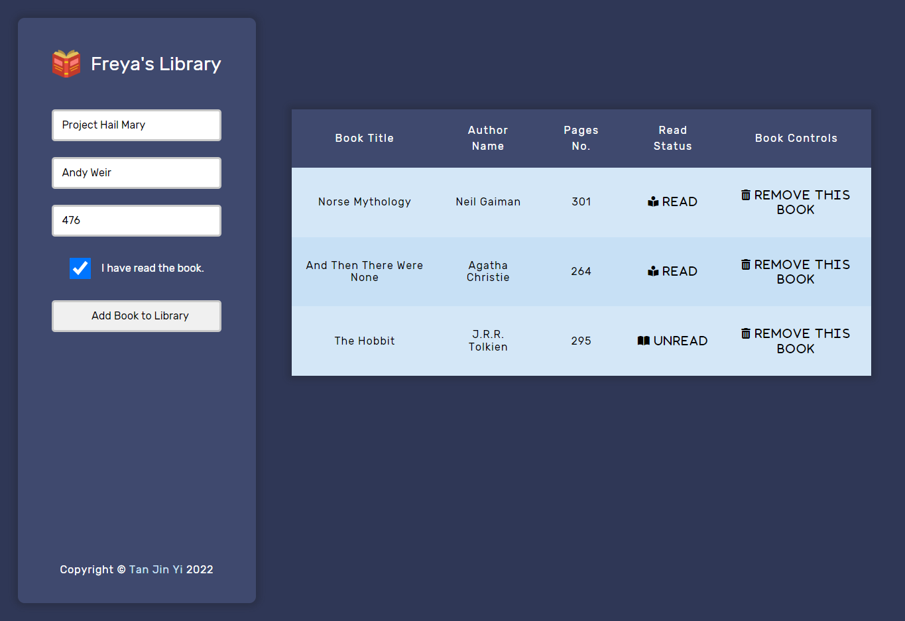

# TOP Template

This is Freya's Library, a place where you can manage and store your books.

## Live Preview

This project is hosted on **GitHub Pages**. Feel free to [:point_right: try it out](https://raineedust.github.io/freya-library/)!

## Motivation and Goals

- [x] Implement semantic HTML
- [x] Implement book display UI and logic
- [x] Implement input UI and logic
- [x] Implement deletion UI and logic
- [x] Implement read status switching logic
- [x] Follow ESLint rules
- [x] Make it pretty!

## Limitations

- None, as all the requirements of this project were met.

## Resources

Below are a collection of resources which helped improve my skills :sparkles: while building the project:

- [html - When to use \ instead \
? - Stack Overflow](https://stackoverflow.com/questions/1908234/when-to-use-span-instead-p)
- [javascript - How can I check if a checkbox is checked? - Stack Overflow](https://stackoverflow.com/questions/9887360/how-can-i-check-if-a-checkbox-is-checked)
- [Semantic HTML5 Elements Explained](https://www.freecodecamp.org/news/semantic-html5-elements/)
- [JavaScript Array forEach() Method](https://www.w3schools.com/jsref/jsref_foreach.asp)
- [HTML DOM Table insertRow() Method](https://www.w3schools.com/jsref/met_table_insertrow.asp)
- [javascript - Finding index of the parent node - Stack Overflow](https://stackoverflow.com/questions/23337891/finding-index-of-the-parent-node)
- [html - Using CSS to insert text - Stack Overflow](https://stackoverflow.com/questions/2741312/using-css-to-insert-text)
- [HTML DOM Element classList Property](https://www.w3schools.com/jsref/prop_element_classlist.asp)
- [javascript - ".addEventListener is not a function" why does this error occur? - Stack Overflow](https://stackoverflow.com/questions/32027935/addeventlistener-is-not-a-function-why-does-this-error-occur)
- [jquery - How to reset (clear) form through JavaScript? - Stack Overflow](https://stackoverflow.com/questions/3786694/how-to-reset-clear-form-through-javascript)
- [css - How to justify a single flexbox item (override justify-content) - Stack Overflow](https://stackoverflow.com/questions/23621650/how-to-justify-a-single-flexbox-item-override-justify-content)

Built with :heart: to **The Odin Project**, a wonderful Web Development curriculum ~

## Acknowledgements

- [Font Awesome](https://fontawesome.com/)
- [Browse Fonts - Google Fonts](https://fonts.google.com/)
- [GitHub - sindresorhus/modern-normalize: 🐒 Normalize browsers' default style](https://github.com/sindresorhus/modern-normalize)
- [Icons by Smashicons](https://www.flaticon.com/authors/smashicons)
